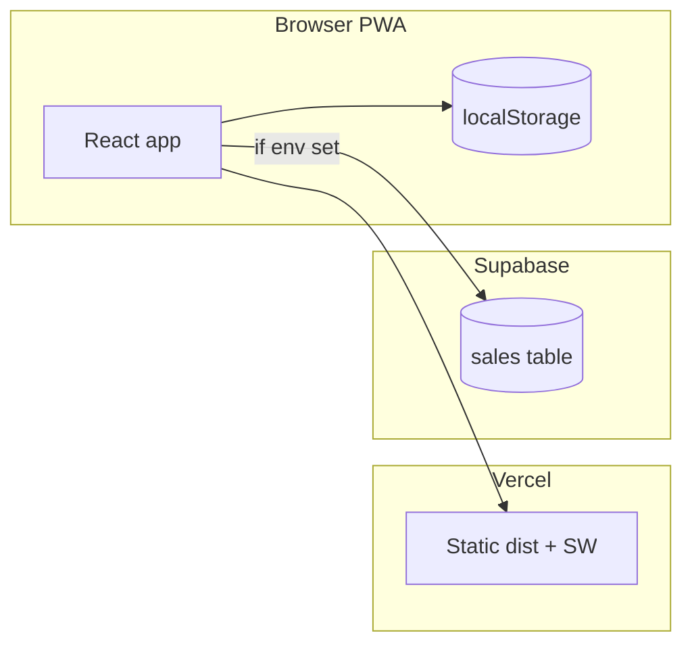

# Showroom — Invoices

Mobile-first **invoice / payment tracker** for a showroom: list by month or financial year, record sales, track due amounts, call/WhatsApp links, optional **Supabase** cloud sync, **PWA** install support.

## Stack

- React 19, TypeScript, Vite 8, React Router 7  
- Supabase (Postgres + anon/publishable key) when `VITE_*` env vars are set; otherwise **localStorage**  
- Deploy: **Vercel** (see `vercel.json` SPA rewrite)  
- DB schema: `supabase/migrations/20260401000000_sales.sql`

## Scripts

| Command | Purpose |
|--------|---------|
| `npm run dev` | Local dev server |
| `npm run build` | Typecheck + production build (`dist/`) |
| `npm run preview` | Preview `dist/` locally |
| `npm run lint` | ESLint |
| `npm run deploy` | Manual production deploy via Vercel CLI (optional if Git auto-deploy is on) |

## Environment

Copy `.env.example` → `.env.local`. Set:

- `VITE_SUPABASE_URL` — Supabase project URL  
- `VITE_SUPABASE_ANON_KEY` — **Publishable** key (`sb_publishable_…`) or legacy **anon** JWT from the API settings page  

If either is missing, the app runs in **offline-first localStorage** mode only.

## Deploy & security

See **[DEPLOY.md](./DEPLOY.md)** for Supabase SQL, Vercel env vars, PWA notes, and a **future data protection** checklist.

## Repo

Remote: [github.com/biswajit82232/showroom](https://github.com/biswajit82232/showroom). With Vercel **Git integration**, pushes to the production branch (e.g. `main`) trigger deploys.

## How pieces connect

